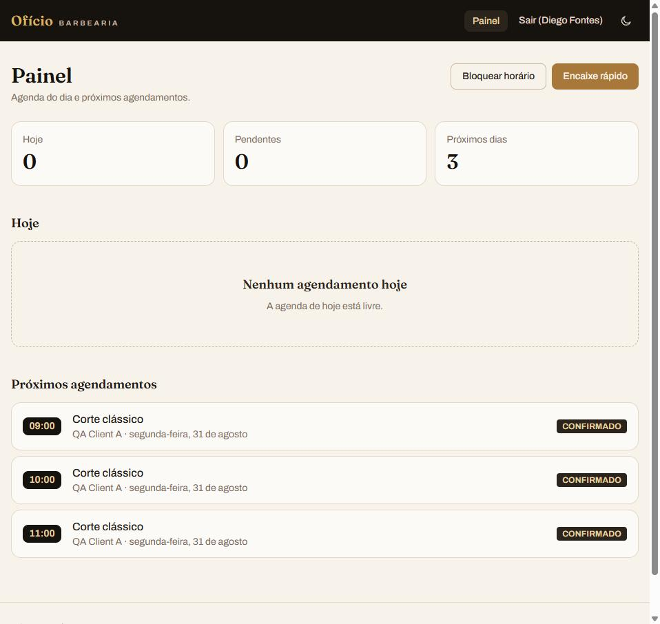

# Barber Booking Platform

Plataforma de agendamento para barbearias, com foco em um **booking engine real**:
disponibilidade calculada por profissional, proteção contra reservas
concorrentes ao nível do banco de dados, e um console de barbeiro funcional
(agenda do dia, bloqueio de horário, encaixe de cliente presencial).

**🔗 Live demo:** https://barber-booking-platform-ten.vercel.app
**🔗 API pública:** https://barber-booking-platform-mi94.onrender.com/health

> A API roda em plano gratuito (Render) e "dorme" após períodos de
> inatividade — a primeira requisição pode levar até ~50s pra acordar o
> serviço. O frontend mostra um aviso de carregamento nesse caso.

## Credenciais de demonstração

| Papel | Email | Senha |
|---|---|---|
| Cliente | crie sua própria conta em "Cadastre-se" | — |
| Barbeiro | `marcos.demo@barberbooking.test` | `DemoBarber123!` |
| Barbeiro | `diego.demo@barberbooking.test` | `DemoBarber123!` |

## O problema

Agendamento de barbearia parece simples até dois clientes tentarem marcar o
mesmo horário com o mesmo barbeiro ao mesmo tempo. A maior parte dos
projetos de portfólio resolve isso só na camada de aplicação (um `SELECT`
antes do `INSERT`) — o que quebra sob concorrência real. Este projeto resolve
com uma trava de verdade no banco.

## Screenshots

| Home | Booking (comanda) | Painel do barbeiro |
|---|---|---|
|  |  |  |

## Arquitetura

```
frontend/   React + TypeScript + Vite + Tailwind        → Vercel
backend/    ASP.NET Core (.NET 10) + EF Core             → Render (Docker)
            PostgreSQL 18                                → Neon
```

- **Domain** (`BarberBooking.Domain`): entidades e regras de negócio puras
  (cálculo de disponibilidade, checagem de conflito).
- **Infrastructure** (`BarberBooking.Infrastructure`): EF Core, `DbContext`,
  migrations, Identity.
- **Api** (`BarberBooking.Api`): controllers, autenticação JWT, DI,
  configuração de produção.

Sem camada "Application" separada — regra de negócio fica em Domain, chamada
direto pelos controllers. Sem microservices, sem fila de mensagens, sem
Kubernetes: a complexidade real do problema (concorrência) está resolvida no
nível certo, não escondida atrás de infraestrutura desnecessária.

## O booking engine

O núcleo técnico do projeto: garantir que dois agendamentos nunca se
sobreponham para o mesmo barbeiro, mesmo sob concorrência real.

**Duas camadas de proteção:**

1. **Precheck de aplicação** (`AppointmentConflictChecker`): consulta os
   agendamentos existentes do barbeiro no período e rejeita cedo se houver
   conflito óbvio — evita uma tentativa de `INSERT` fadada a falhar na
   maioria dos casos, mas por si só não é suficiente sob concorrência real
   (race entre a consulta e o insert).
2. **Exclusion constraint no PostgreSQL** (fonte da verdade): a extensão
   `btree_gist` habilita uma constraint que impede, a nível de banco, dois
   registros com o mesmo `BarberId` cujos intervalos `tstzrange(StartUtc,
   EndUtc)` se sobreponham — cancelados são ignorados.

   ```sql
   ALTER TABLE "Appointments"
   ADD CONSTRAINT "EX_Appointments_BarberId_TimeRange"
   EXCLUDE USING gist (
       "BarberId" WITH =,
       tstzrange("StartUtc", "EndUtc", '[)') WITH &&
   )
   WHERE ("Status" <> 'Cancelled');
   ```

   Sob corrida real (duas requisições simultâneas pro mesmo slot), o
   PostgreSQL rejeita uma delas com `23P01` (exclusion violation) ou, em
   casos de deadlock, `40P01` — a API traduz ambos para `409 Conflict`. Isso
   é testado de verdade: os testes de integração disparam requisições HTTP
   concorrentes contra um PostgreSQL real (via Testcontainers) e exigem
   exatamente um `201` e um `409`.

   O agendamento normal do cliente e o "encaixe" (walk-in) criado pelo
   barbeiro passam por controllers distintos, mas ambos escrevem na mesma
   tabela `Appointments` e caem sob a mesma exclusion constraint — não existe
   atalho de escrita que contorne a trava.

## Segurança e autorização

- **Autenticação:** JWT via ASP.NET Identity, roles como claims
  (`Client` / `Barber` / `Admin`).
- **Autorização por ownership:** cliente só vê/cancela os próprios
  agendamentos; barbeiro só vê/gerencia a própria agenda; admin vê tudo.
- **Anti-IDOR:** cancelamento de agendamento fora do escopo do usuário
  retorna `404` (não `403`), para não revelar a existência do recurso a quem
  não tem permissão sobre ele. Endpoints de gestão de agenda (bloqueio,
  walk-in) retornam `403` para barbeiro fora do próprio `barberId` — esse id
  já é público via `GET /api/barbers`, então não há exposição de existência
  ali.
- **Sem segredo versionado:** JWT signing key, connection string e demais
  segredos vivem em variáveis de ambiente por ambiente (nunca no `appsettings`
  commitado). CORS restrito por allow-list configurável.

## Testes

- **Backend:** xUnit + Testcontainers — testes de integração rodam contra
  PostgreSQL real (não mock), cobrindo autenticação, autorização/IDOR,
  disponibilidade, timezone, e a corrida de concorrência real descrita acima.
- **Frontend:** Vitest + Testing Library.
- **CI:** GitHub Actions roda build + suíte completa (incluindo os testes de
  integração com Postgres via Testcontainers) em todo push/PR para `main`.

```
cd backend && dotnet test
cd frontend && npm test
```

## Rodando localmente

Requer Docker.

```bash
docker compose up --build
```

Sobe PostgreSQL + API com um comando só. Em banco vazio, popula
automaticamente 2 barbeiros de demonstração, 3 serviços e disponibilidade
recorrente (seg-sex, 9h-18h) — as mesmas credenciais demo listadas acima.

- API: http://localhost:8080 · Swagger: http://localhost:8080/swagger

Frontend:

```bash
cd frontend
npm install
npm run dev
```

Configure `frontend/.env` com `VITE_API_URL=http://localhost:8080` (veja
`.env.example`).

## Decisões técnicas

- **Exclusion constraint em vez de lock de aplicação:** locks distribuídos
  (Redis, `SELECT ... FOR UPDATE`) resolvem o problema, mas dependem de
  disciplina de código em todo caminho que escreve. Uma constraint de banco
  não pode ser esquecida ou contornada.
- **JWT sem refresh token:** escopo do projeto não justifica a complexidade
  de rotação de refresh token — expira, usuário loga de novo.
- **Sem admin panel:** gestão de serviços/barbeiros acontece via seed
  (dev/demo). Um CRUD administrativo completo viraria facilmente um ERP,
  fora do escopo proposto.
- **`.ics` gerado no client:** confirmação de agendamento gera um arquivo de
  calendário localmente (RFC 5545), sem depender de integração externa.

## Limitações conhecidas

- Plano gratuito do Render "dorme" a API após inatividade (cold start de até
  ~50s na primeira requisição).
- As credenciais demo de barbeiro concedem autoridade real sobre a agenda
  daquele barbeiro (bloqueio de horários, cancelamento de agendamentos).
  Não há endpoint para desfazer um bloqueio nem reset automático dos dados
  demo — em caso de uso indevido do ambiente público, a limpeza é manual no
  banco.
- Sem gestão administrativa de serviços/barbeiros via UI — só via seed.
- Calendário do barbeiro limitado a seleção de data via input nativo (sem
  grid de mês customizado).
- Confirmação de agendamento não envia WhatsApp/e-mail real (fora do escopo
  gratuito do projeto).
- Não há endpoint público para provar que a imagem atualmente executada no
  Render corresponde ao SHA do commit ou para comparar formalmente o schema
  ativo no Neon; isso permanece como lacuna de evidência de release, sem
  evidência de drift conhecida.

## Roadmap

- Comanda de confirmação com envio real de notificação (WhatsApp/e-mail).
- KPIs na Chair Timeline (faturamento, taxa de ocupação).
- Endpoint administrativo para provisionar barbeiros/serviços sem SQL manual.

## Sobre o desenvolvimento

Este projeto foi construído com assistência de IA (Claude Code, Codex) como
ferramenta de engenharia — para implementação, revisão de código, pesquisa
de UX/design e QA — sob orquestração e decisões técnicas supervisionadas.
Todo código foi revisado, testado e validado antes de ir para produção; o
processo está documentado nos commits do repositório.
